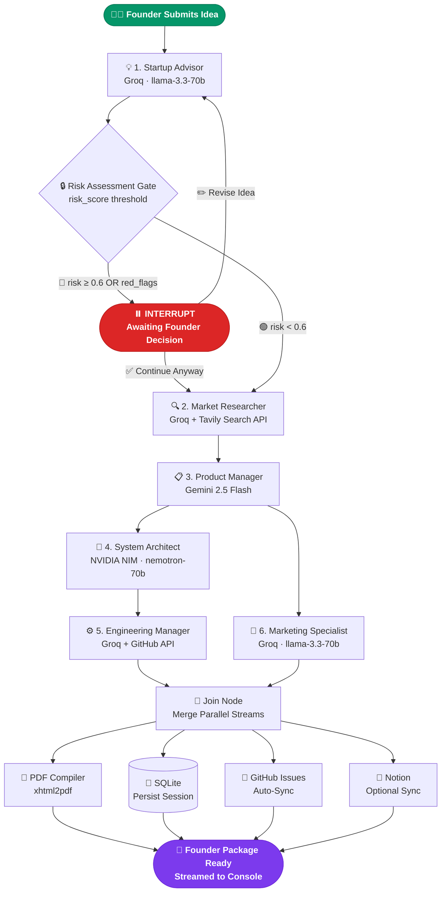
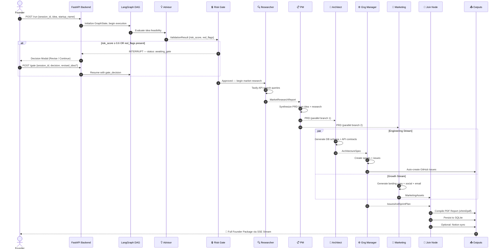

<div align="center">

<br/>

```
██████╗██╗     ██╗   ██╗███████╗██████╗ ██████╗ ██╗███╗   ██╗████████╗
██╔══██╗██║     ██║   ██║██╔════╝██╔══██╗██╔══██╗██║████╗  ██║╚══██╔══╝
██████╔╝██║     ██║   ██║█████╗  ██████╔╝██████╔╝██║██╔██╗ ██║   ██║   
██╔══██╗██║     ██║   ██║██╔══╝  ██╔═══╝ ██╔══██╗██║██║╚██╗██║   ██║   
██████╔╝███████╗╚██████╔╝███████╗██║     ██║  ██║██║██║ ╚████║   ██║   
╚═════╝ ╚══════╝ ╚═════╝ ╚══════╝╚═╝     ╚═╝  ╚═╝╚═╝╚═╝  ╚═══╝   ╚═╝  
```

### 🚀 AI Founder Orchestration System

**Turn a raw startup idea into a complete, founder-ready package — in minutes.**

*Six specialized AI agents. One stateful pipeline. Zero guesswork.*

<br/>

[](https://nextjs.org/)
[](https://fastapi.tiangolo.com/)
[](https://langchain-ai.github.io/langgraph/)
[](https://groq.com/)
[](https://sqlite.org/)
[](https://www.typescriptlang.org/)
[](https://python.org/)

<br/>
[](https://github.com/varun2507027108-oss)

</div>

---

## 📖 What is Blueprint?

Blueprint is a **production-grade, multi-agent AI pipeline** that transforms a rough startup idea into a fully structured founder package. Submit your concept, and six specialized AI agents — each powered by a different frontier LLM — collaborate through a stateful LangGraph DAG to deliver:

| 📄 Artifact | 🤖 Produced By |
|---|---|
| Risk Assessment & Feasibility Report | Startup Advisor |
| Competitive Intelligence & TAM Analysis | Market Researcher |
| Full Product Requirements Document (PRD) | Product Manager |
| Database Schema & API Contracts | System Architect |
| Sprint Plan & GitHub Issues (auto-synced) | Engineering Manager |
| Landing Copy, LinkedIn Post & Email Campaign | Marketing Specialist |
| **Compiled PDF Report (all of the above)** | PDF Compiler (auto-triggered) |

> A **Human-in-the-Loop interrupt gate** sits after the Advisor — so you stay in control before any pipeline resources are spent.

---

## 📑 Table of Contents

<details>
<summary><strong>Expand Navigation</strong></summary>

- [System Architecture](#-system-architecture)
- [Data Flow Diagram](#-data-flow-diagram)
- [Meet the Agents](#-meet-the-agents)
- [How the Pipeline Works](#-how-the-pipeline-works)
- [Tech Stack](#-tech-stack)
- [Project Structure](#-project-structure)
- [Quick Start](#-quick-start)
- [Environment Variables](#-environment-variables)
- [API Reference](#-api-reference)
- [Roadmap](#-roadmap)
- [Contributing](#-contributing)

</details>

---

## 🗺️ System Architecture

> The workflow is managed as a **stateful LangGraph DAG**, executing agents through a parallel-branching pipeline and persisting all intermediate artifacts to a local SQLite database.



---

## 🔄 Data Flow Diagram

> This diagram shows **what data structures are created, consumed, and transformed** as your idea moves through each agent in the pipeline.

```mermaid
flowchart LR
    subgraph INPUT["📥 INPUT"]
        I1["StartupInput\n─────────\nsession_id: str\nstartup_name: str\nidea: str\ngithub_repo?: str"]
    end

    subgraph ADVISOR["💡 Startup Advisor"]
        A1["Reads: StartupInput"]
        A2["Produces: ValidationResult\n──────────────────\nverdict: str\nrisk_score: float 0.0–1.0\nreasoning: str\nred_flags: list[str]"]
    end

    subgraph GATE["🔒 Risk Gate"]
        G1{"risk_score ≥ 0.6\nOR red_flags?"}
        G2["GraphState.gate_decision\n= 'continue' | 'revise'"]
    end

    subgraph RESEARCHER["🔍 Market Researcher"]
        R1["Reads: idea + ValidationResult"]
        R2["Produces: MarketResearchReport\n────────────────────────\ntam_estimate: str\ncompetitors: list[Competitor]\ntrends: list[str]\nsources: list[str]"]
    end

    subgraph PM["📋 Product Manager"]
        P1["Reads: idea + MarketResearchReport"]
        P2["Produces: PRD\n────────────────\nproblem_statement: str\nuser_stories: list[str]\nfeatures: list[Feature]\nroadmap_phases: list[Phase]"]
    end

    subgraph PARALLEL["⚡ Parallel Execution"]
        subgraph ENG["Engineering Stream"]
            AR["📐 Architect → ArchitectureSpec\n─────────────────────────\ndb_schema_sql: str DDL\ndb_schema_mermaid: str\napi_endpoints: list[Endpoint]\nsystem_design_notes: str"]
            EM["⚙️ Eng Manager → IssuesAndSprintPlan\n────────────────────────────────\nissues: list[Issue]\nsprints: list[Sprint]"]
        end
        subgraph MKT["Growth Stream"]
            MK["📣 Marketing → MarketingAssets\n──────────────────────────────\nlanding_copy: str\nlinkedin_post: str\nemail_campaign: str"]
        end
    end

    subgraph OUTPUT["📤 OUTPUT"]
        O1["GraphState\nFull Session Snapshot\n────────────────────\nAll artifacts merged"]
        O2["📄 PDF Report\nAll artifacts compiled"]
        O3["🐙 GitHub Issues\nAuto-created"]
        O4["💾 SQLite Row\nPersisted"]
    end

    INPUT --> ADVISOR
    ADVISOR --> GATE
    GATE -->|"INTERRUPT"| GATE
    GATE -->|"Pass"| RESEARCHER
    RESEARCHER --> PM
    PM --> PARALLEL
    AR --> EM
    PARALLEL --> OUTPUT

    style INPUT fill:#1e3a2f,stroke:#059669,color:#d1fae5
    style ADVISOR fill:#1e2d40,stroke:#3B82F6,color:#bfdbfe
    style GATE fill:#3b1f1f,stroke:#DC2626,color:#fecaca
    style RESEARCHER fill:#1e2d40,stroke:#3B82F6,color:#bfdbfe
    style PM fill:#2d1f3b,stroke:#8B5CF6,color:#ede9fe
    style PARALLEL fill:#1a2e1a,stroke:#10B981,color:#d1fae5
    style OUTPUT fill:#2d2d1a,stroke:#F59E0B,color:#fef3c7
    style ENG fill:#1e2a1e,stroke:#34D399,color:#d1fae5
    style MKT fill:#1e2a1e,stroke:#34D399,color:#d1fae5
```



---

## 👥 Meet the Agents

<details>
<summary><strong>💡 1. Startup Advisor — Risk Gatekeeper</strong></summary>

<br/>

> **Role**: The first line of defense. Evaluates your raw concept before a single API token is spent downstream.

| Property | Detail |
|---|---|
| **LLM** | Groq · `llama-3.3-70b-versatile` |
| **API Key** | `ADVISOR_API_KEY` → fallback `GROQ_API_KEY` |
| **Model Override** | `ADVISOR_MODEL` → fallback `GROQ_MODEL` |
| **Gate Trigger** | `risk_score ≥ 0.6` OR `len(red_flags) > 0` |

**What it evaluates:**
- Value proposition complexity & differentiation
- Market saturation & competitive density
- Resource constraints & execution bottlenecks
- Regulatory or compliance hurdles

**Output Schema: `ValidationResult`**
```python
class ValidationResult(BaseModel):
    verdict: str           # "Approved" | "Needs Revision"
    risk_score: float      # 0.0 (safe) → 1.0 (extreme risk)
    reasoning: str         # Deep justification
    red_flags: list[str]   # Specific blockers
```

</details>

---

<details>
<summary><strong>🔍 2. Market Researcher — Competitive Intelligence Engine</strong></summary>

<br/>

> **Role**: Grounds your idea in real-world market data via live web search. No hallucinated competitors.

| Property | Detail |
|---|---|
| **LLM** | Groq · `llama-3.3-70b-versatile` |
| **Tool** | Tavily Search API (`tools/tavily.py`) |
| **API Key** | `RESEARCHER_API_KEY` → fallback `GROQ_API_KEY` |

**What it discovers:**
- Total Addressable Market (TAM) sizing
- Top 5–10 competitors with descriptions & URLs
- Macro/micro industry trends
- Credible source validation

**Output Schema: `MarketResearchReport`**
```python
class MarketResearchReport(BaseModel):
    tam_estimate: str              # Market size estimate
    competitors: list[Competitor]  # {name, description, url}
    trends: list[str]              # Key market trends
    sources: list[str]             # Verified URLs
```

</details>

---

<details>
<summary><strong>📋 3. Product Manager — PRD Architect</strong></summary>

<br/>

> **Role**: Synthesizes the startup concept + market data into a founder-ready Product Requirements Document.

| Property | Detail |
|---|---|
| **LLM** | Google Gemini · `gemini-2.5-flash` |
| **API Key** | `PM_API_KEY` → fallback `GEMINI_API_KEY` |
| **Model Override** | `PM_MODEL` → fallback `GEMINI_MODEL` |

**What it produces:**
- Crisp problem statement
- User stories in standard format
- Feature list with `High/Medium/Low` priority
- Phased product roadmap

**Output Schema: `PRD`**
```python
class PRD(BaseModel):
    problem_statement: str         # Core problem being solved
    user_stories: list[str]        # "As a [user], I want..."
    features: list[Feature]        # {name, description, priority}
    roadmap_phases: list[Phase]    # {name, items: list[str]}
```

</details>

---

<details>
<summary><strong>📐 4. System Architect — Technical Foundation Designer</strong></summary>

<br/>

> **Role**: Translates PRD features into concrete database schemas, API contracts, and system design decisions.

| Property | Detail |
|---|---|
| **LLM** | NVIDIA NIM · `nvidia/llama-3.1-nemotron-70b-instruct` |
| **API Key** | `ARCHITECT_API_KEY` → fallback `NVIDIA_NIM_API_KEY` |
| **Model Override** | `ARCHITECT_MODEL` → fallback `NVIDIA_NIM_MODEL` |

**What it designs:**
- Valid DDL SQL (tables, constraints, relationships)
- Mermaid ER diagram for visual documentation
- REST API endpoint contracts
- Architecture recommendations (caching, patterns, integrations)

**Output Schema: `ArchitectureSpec`**
```python
class ArchitectureSpec(BaseModel):
    db_schema_sql: str              # Full DDL SQL script
    db_schema_mermaid: str          # Mermaid ER diagram
    api_endpoints: list[Endpoint]   # {method, path, description}
    system_design_notes: str        # Technical recommendations
```

</details>

---

<details>
<summary><strong>⚙️ 5. Engineering Manager — Sprint Planner & GitHub Sync</strong></summary>

<br/>

> **Role**: Converts architecture specs into developer-ready sprint plans and auto-creates GitHub issues.

| Property | Detail |
|---|---|
| **LLM** | Groq · `llama-3.3-70b-versatile` |
| **Tool** | GitHub REST API (`tools/github.py`) |
| **API Key** | `EM_API_KEY` → fallback `GROQ_API_KEY` |
| **Requires** | `GITHUB_TOKEN` for issue auto-creation |

**What it creates:**
- Categorized developer task list with labels
- Sprint-mapped development cycles
- Auto-created GitHub issues (if `github_repo` is provided)

**Output Schema: `IssuesAndSprintPlan`**
```python
class IssuesAndSprintPlan(BaseModel):
    issues: list[Issue]   # {title, body, labels: list[str]}
    sprints: list[Sprint] # {name, issue_titles: list[str]}
```

</details>

---

<details>
<summary><strong>📣 6. Marketing Specialist — Launch Copy Generator</strong></summary>

<br/>

> **Role**: Converts product capabilities into conversion-ready marketing assets — in parallel with the Engineering stream.

| Property | Detail |
|---|---|
| **LLM** | Groq · `llama-3.3-70b-versatile` |
| **API Key** | `MARKETING_API_KEY` → fallback `GROQ_API_KEY` |
| **Runs** | In parallel with Architect + Engineering Manager |

**What it generates:**
- Hero headlines, sub-headlines & landing page body copy
- LinkedIn launch post (structured, ready-to-post)
- Email outreach sequence targeting early adopters

**Output Schema: `MarketingAssets`**
```python
class MarketingAssets(BaseModel):
    landing_copy: str      # Hero + sub-headline + body copy
    linkedin_post: str     # Structured social post
    email_campaign: str    # Outreach email sequence
```

</details>

---

## ⚙️ How the Pipeline Works



---

## 🛠️ Tech Stack

| Layer | Technology | Purpose |
|---|---|---|
| **Frontend** | Next.js 15 (App Router) | Founder intake form, live tracking console |
| **Frontend** | TypeScript | Type-safe components |
| **Frontend** | Framer Motion | Animated state transitions |
| **Backend** | FastAPI | REST API server, SSE streaming |
| **Orchestration** | LangGraph | Stateful DAG, interrupt/resume logic |
| **LLM — Advisor/Researcher/EM/Marketing** | Groq · llama-3.3-70b-versatile | Ultra-fast inference |
| **LLM — Product Manager** | Google Gemini 2.5 Flash | Long-context synthesis |
| **LLM — System Architect** | NVIDIA NIM · nemotron-70b | Technical precision |
| **Search Tool** | Tavily Search API | Real-time competitive intelligence |
| **Database** | SQLite | Session persistence (demo-ready) |
| **PDF Export** | xhtml2pdf | Compiled founder report |
| **Integrations** | GitHub REST API | Auto-create issues |
| **Integrations** | Notion API | Optional database sync |
| **Deployment** | Vercel (frontend) + Render (backend) | Free-tier production |

---

## 📂 Project Structure

```
AI-Orchestration-System/
│
├── 📁 backend/
│   ├── main.py              # FastAPI app server & REST endpoints
│   ├── graph.py             # LangGraph DAG: nodes, edges, routing logic
│   ├── models.py            # Pydantic schemas & GraphState definitions
│   ├── db.py                # SQLite persistence handlers
│   ├── config.py            # Environment variable loader
│   ├── requirements.txt     # Python dependencies
│   ├── test_api.py          # End-to-end integration tests
│   └── 📁 tools/
│       ├── tavily.py        # Tavily Search API wrapper
│       ├── github.py        # GitHub Issues auto-sync client
│       ├── notion.py        # Notion database sync (optional)
│       └── pdf_export.py    # xhtml2pdf report compiler
│
├── 📁 frontend/
│   ├── 📁 app/
│   │   ├── page.tsx         # Landing page
│   │   ├── intake/          # Startup idea submission form
│   │   └── console/         # Live agent tracking dashboard
│   ├── 📁 components/       # Reusable UI + Framer Motion animations
│   ├── 📁 lib/              # Utility functions & API clients
│   ├── package.json         # Node dependencies & scripts
│   └── tsconfig.json        # TypeScript config
│
├── .gitignore
├── tsconfig.json
└── README.md
```

---

## 🚀 Quick Start

### Prerequisites

- Python 3.11+
- Node.js 18+
- API keys: Groq, Gemini, NVIDIA NIM, Tavily (all have free tiers)

### 1. Clone & Setup Backend

```bash
git clone https://github.com/varun2507027108-oss/AI-Orchestration-System.git
cd AI-Orchestration-System/backend

# Create virtual environment
python -m venv venv
source venv/bin/activate   # Windows: venv\Scripts\activate

# Install dependencies
pip install -r requirements.txt

# Configure environment
cp .env.example .env
# → Fill in your API keys in .env

# Start the backend
uvicorn main:app --reload --port 8000
```

### 2. Setup Frontend

```bash
cd ../frontend

# Install dependencies
npm install

# Configure environment
cp .env.local.example .env.local
# → Set NEXT_PUBLIC_BACKEND_URL=http://localhost:8000

# Start the dev server
npm run dev
```

### 3. Open in Browser

```
http://localhost:3000
```

Submit your startup idea from the intake page and watch all 6 agents run live in the console.

---

## 🔐 Environment Variables

<details>
<summary><strong>View all environment variables</strong></summary>

```bash
# ─── LLM API Keys (Generic) ───────────────────────────────────
GROQ_API_KEY=your_groq_api_key
GEMINI_API_KEY=your_gemini_api_key
NVIDIA_NIM_API_KEY=your_nvidia_nim_api_key
TAVILY_API_KEY=your_tavily_api_key

# ─── LLM API Keys (Agent-Specific, falls back to generic) ─────
ADVISOR_API_KEY=
RESEARCHER_API_KEY=
PM_API_KEY=
ARCHITECT_API_KEY=
EM_API_KEY=
MARKETING_API_KEY=

# ─── LLM Models (Generic defaults) ───────────────────────────
GROQ_MODEL=llama-3.3-70b-versatile
GEMINI_MODEL=gemini-2.5-flash
NVIDIA_NIM_MODEL=nvidia/llama-3.1-nemotron-70b-instruct

# ─── LLM Models (Agent-Specific overrides) ───────────────────
ADVISOR_MODEL=
RESEARCHER_MODEL=
PM_MODEL=
ARCHITECT_MODEL=
EM_MODEL=
MARKETING_MODEL=

# ─── Integration Tokens (Optional) ───────────────────────────
GITHUB_TOKEN=your_github_personal_access_token
NOTION_TOKEN=your_notion_integration_token
NOTION_DATABASE_ID=your_notion_database_id

# ─── Server Configuration ─────────────────────────────────────
NEXT_PUBLIC_BACKEND_URL=http://localhost:8000
ALLOWED_ORIGIN=http://localhost:3000
```

> 💡 **Tip**: Agent-specific keys and models are optional. The system falls back to the generic keys/models automatically, so you can start with just `GROQ_API_KEY`, `GEMINI_API_KEY`, `NVIDIA_NIM_API_KEY`, and `TAVILY_API_KEY`.

</details>

---

## 🔌 API Reference

| Method | Endpoint | Description |
|---|---|---|
| `POST` | `/run` | Submit a startup idea & launch the pipeline |
| `GET` | `/status/{session_id}` | Poll current session state & agent progress |
| `POST` | `/gate` | Resolve the human-in-the-loop risk gate |
| `GET` | `/results/{session_id}` | Retrieve completed founder package |
| `GET` | `/export/{session_id}/pdf` | Download the compiled PDF report |
| `GET` | `/health` | Backend health check |

<details>
<summary><strong>POST /run — Request Body</strong></summary>

```json
{
  "session_id": "uuid-here",
  "startup_name": "Acme AI",
  "idea": "A platform that uses AI to automatically generate custom onboarding flows for SaaS products based on the user's role and behavior.",
  "github_repo": "your-org/your-repo"
}
```

</details>

<details>
<summary><strong>POST /gate — Request Body</strong></summary>

```json
{
  "session_id": "uuid-here",
  "decision": "revise",
  "revised_idea": "Updated and refined idea text goes here..."
}
```

`decision` can be `"continue"` (ignore risk, proceed) or `"revise"` (loop back to Advisor with new input).

</details>

---

## 🗺️ Roadmap

- [x] Six-agent stateful LangGraph pipeline
- [x] Human-in-the-loop risk gate with interrupt/resume
- [x] Multi-provider LLM routing (Groq / Gemini / NVIDIA NIM)
- [x] Tavily live market research integration
- [x] GitHub Issues auto-sync
- [x] PDF report compiler
- [x] Notion optional sync
- [x] SSE streaming to Next.js console
- [ ] Voice input for idea submission
- [ ] Pitch deck auto-generation (PowerPoint export)
- [ ] Financial model generator (unit economics, burn rate)
- [ ] Competitor monitoring alerts (recurring Tavily scans)
- [ ] Multi-session workspace with history
- [ ] One-click deploy to Railway / Render / Fly.io
- [ ] Open-source LLM support via Ollama

---

## 🤝 Contributing

Contributions are welcome! Here's how to get started:

```bash
# 1. Fork the repository
# 2. Create a feature branch
git checkout -b feature/your-feature-name

# 3. Make your changes & commit
git commit -m "feat: add your feature description"

# 4. Push to your fork
git push origin feature/your-feature-name

# 5. Open a Pull Request
```

**Good first issues:**
- Add a new agent (e.g., Legal Advisor, Financial Modeler)
- Improve the PDF report layout
- Add unit tests for graph nodes
- Improve SSE streaming stability

---

## 👨‍💻 Author

<div align="center">

**Varun** · Team PARALLAX


[](https://github.com/varun2507027108-oss)

</div>

---


<div align="center">

*Built with obsessive attention to detail during edQuest · Team PARALLAX*

**If Blueprint helped you, drop a ⭐ — it means a lot.**

</div>
